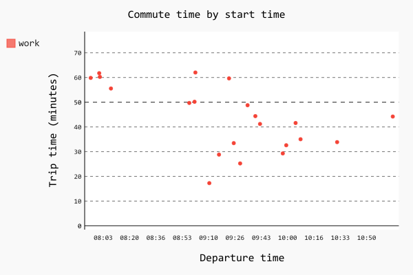
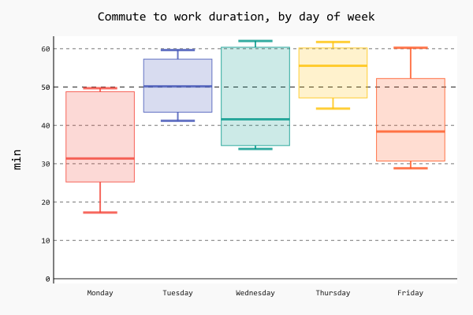

This repo holds collection of Python scripts to analyze trip information extracted from [Automatic](https://developer.automatic.com/api-reference/#rest-api).

## Sample charts 

### Commute duration

### Commute to work duration by departure time

### Commute to work duration by day of week

## How to use it

### Get trip data from Automatic

To extract data from Automatic using their REST API you would need to obtain access token first. Follow [the isntructions](https://developer.automatic.com/my-apps/) on Automatic website.

Once you have token, you can fetch the list of your trips from Automatic:

    AUTOMATIC_ACCESS_TOKEN=<your token here>
    curl "https://api.automatic.com/trip/?limit=250" -H "Authorization:Bearer $AUTOMATIC_ACCESS_TOKEN" | jq '.results' > trips.json

### Install Python packages

    mkvirtualenv automatic
    workon automatic
    pip install -q -r requirements.txt
    
### Convert trip data to CVS format

I was too lazy to ingest and parse trip data in json format, so you would need to convert it to CSV first:

    python json-to-csv.py > out.csv
    
### Create charts

    python plot.py

